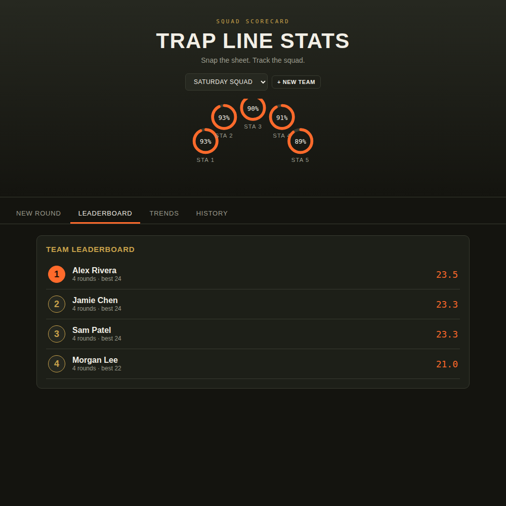

# Trap Scorecard

Docker Compose stack: Postgres + a Node/TypeScript API that also serves
the scorecard frontend as static files. SSL and the reverse proxy are
handled by your existing Nginx Proxy Manager VM, not by anything in this
stack.



## Layout
```
docker-compose.yml
.env.example
backend/
  Dockerfile
  package.json
  tsconfig.json
  sql/init.sql             <- schema, auto-loaded on first Postgres start (fresh installs only)
  sql/migrations/
    001_add_teams.sql       <- run manually against an existing database to add team support
    002_add_auth.sql        <- run manually against an existing database to add user accounts
    003_add_user_name.sql   <- run manually to add the optional display-name column to users
    004_add_yardage.sql     <- run manually to add the yardage column to rounds
    005_add_round_number.sql <- run manually to add the round-number column to rounds
    006_add_substitutes.sql <- run manually to add substitute tracking to scores
    007_add_contact_info.sql <- run manually to add phone/address columns to users
  public/
    index.html              <- the scorecard web app: sign-in/register + admin panel + scoring UI
  src/
    index.ts
    db.ts
    types.ts
    auth.ts                <- password hashing, requireAuth/requireAdmin middleware
    settings.ts             <- DB-backed runtime settings (falls back to .env)
    session.d.ts             <- TypeScript types for the session's logged-in user
    routes/auth.ts          <- POST /api/auth/register, /login, /logout, GET/PUT /me
    routes/admin.ts         <- admin-only: app settings, users, teams, shooters, rounds
    routes/teams.ts         <- GET /api/teams (public, needed for the registration form)
    routes/rounds.ts        <- POST/GET/DELETE /api/rounds (scoped to your session's team)
    routes/stats.ts         <- GET /api/stats/leaderboard, /api/stats/trends (scoped to your team)
    routes/site.ts          <- GET /api/site/leaderboard (cross-team scoreboard)
    routes/extract.ts       <- POST /api/extract (reads scoresheet photos via Claude)
```

## Quick start

NPM runs on its own VM, separate from wherever this stack runs — so
instead of Docker network tricks, the api container just publishes its
port on this VM's network, and NPM proxies to that VM's IP.

1. Find this VM/container's LAN IP (`ip addr` or check it in the Proxmox
   UI) — you'll point NPM at this.
2. `cp .env.example .env` and fill in `POSTGRES_PASSWORD`, `API_HOST_IP`
   (this VM's own IP), `API_HOST_PORT` if 3000 is already taken by
   something else on this VM, `ANTHROPIC_API_KEY` (from
   https://console.anthropic.com/settings/keys), and `SESSION_SECRET`
   (generate one with `openssl rand -base64 32`). The API key and CORS
   origin are just bootstrap defaults now — see Accounts & admin below.
3. `docker compose up -d --build`
4. Visit `http://<this-vm-ip>:<API_HOST_PORT>/` in a browser — you should
   land on a sign-in/register screen.
5. Register the first account. It becomes an admin automatically and
   you'll be asked to create your team's name right there.
6. In the Nginx Proxy Manager UI, add a new **Proxy Host**:
   - Domain: your Cloudflare domain (e.g. `scores.yourclub.com`)
   - Forward Hostname/IP: this VM's LAN IP
   - Forward Port: whatever you set `API_HOST_PORT` to (default `3000`)
   - SSL tab: request a new **Let's Encrypt** certificate, force SSL,
     enable HTTP/2. Use NPM's **DNS Challenge** option with the
     Cloudflare provider and an API token if you'd rather not open port
     80 on your router at all.
7. Test from outside your LAN: visit `https://yourdomain.com/` — sign in
   there and confirm your session persists.

Make sure your Proxmox firewall (and the VM's own firewall, if any) allows
inbound traffic on your chosen `API_HOST_PORT` from the NPM VM's IP
specifically — no need to open it to the whole LAN, let alone the internet.

## Accounts & admin

Everyone needs an account to use the app now — no more anonymous shared
access. Registration asks for an email, password, and a team (join an
existing one or create a new one).

**Recommended: pre-seed an admin account via the LXC script** rather than
relying on self-registration for your first login. When you run
`create-trap-scorecard-lxc.sh`, it'll offer to create a known admin
account (email + a random 15-character password, both saved in the
credentials file and printed at the end) right after the containers come
up — independent of whether anyone ever uses the registration form. This
avoids being blocked if registration has an issue, and avoids the (small,
but real) risk of someone else beating you to the signup page and
becoming admin first if the app is reachable before you get to it.

If you skip that, the app falls back to its original behavior: **the
first account anyone creates via self-registration becomes admin
automatically.**

To pre-seed an admin account manually against an already-running
deployment (or to add a second admin later), the same script the LXC
tool uses is available directly:
```bash
docker compose exec -T api node dist/create-admin.js "you@yourclub.com" "a-real-password" "Your Team Name"
```
It's idempotent — running it again with the same email does nothing if
that account already exists.

Admins get an **Admin** tab in the app with:
- **App settings** — set/replace the Anthropic API key, restrict CORS to
  your real domain, and toggle whether new people can register at all
  (useful once your roster is set and you want to close the signup form).
  These are stored in the database and take effect immediately, no
  redeploy needed — the `.env` values are just what the app falls back to
  before an admin sets anything.
- **Users** — reassign anyone to a different team, promote/demote admins,
  or remove an account.
- **Teams** — create, rename, or delete teams at any time. Deleting a team
  also deletes every shooter, round, and score that belongs to it, so it's
  blocked while any user account is still assigned to that team — reassign
  or remove those users first.
- **Shooters** — add a shooter to a roster ahead of their first round,
  rename one (their score history follows, since it's tied to their
  account row, not their name), move them to a different team, or delete
  them (this also deletes all of their logged scores).
- **Rounds** — browse every round across every team and edit its date,
  round number, yardage, team, or individual scores (including who subbed
  for whom), or delete it outright — not limited to your own team the way
  the regular New Round / History tabs are. Changing the Team dropdown
  moves the round to that team and re-matches shooter names against its
  roster. Shooter-name and "subbing for" fields autocomplete against the
  full cross-team roster to cut down on typos.

Admins also see a **Team** picker at the top of the New Round tab, so they
can log a round on behalf of any team, not just their own — the saved
round shows up under that team everywhere (Dashboard, History, Admin
Rounds), not the admin's own team.

Any signed-in user (not just admins) also gets a **Profile** tab to set an
optional display name, phone number, and mailing address — basic contact
info shown instead of their email around the app, and visible to admins in
the Users table.

Sessions are stored in Postgres (via `connect-pg-simple`) and last 30
days. If you ever change `SESSION_SECRET`, everyone gets signed out — this
is expected, not a bug.

**If you already had this app running before accounts were added**, run
this migration once against your existing database before deploying this
version:
```bash
docker compose exec -T db psql -U trapadmin -d trapscores < backend/sql/migrations/002_add_auth.sql
```
(swap `trapadmin`/`trapscores` for your actual `POSTGRES_USER`/`POSTGRES_DB`
if you changed them). It only adds the new tables — nothing you've already
entered is touched. After that, everyone just registers as normal; the
first person to do so becomes admin.

**If you already had accounts before the Profile tab, yardage, round
numbers, substitutes, or contact info were added**, run these migrations
once against your existing database (all are additive — nothing existing
is touched):
```bash
docker compose exec -T db psql -U trapadmin -d trapscores < backend/sql/migrations/003_add_user_name.sql
docker compose exec -T db psql -U trapadmin -d trapscores < backend/sql/migrations/004_add_yardage.sql
docker compose exec -T db psql -U trapadmin -d trapscores < backend/sql/migrations/005_add_round_number.sql
docker compose exec -T db psql -U trapadmin -d trapscores < backend/sql/migrations/006_add_substitutes.sql
docker compose exec -T db psql -U trapadmin -d trapscores < backend/sql/migrations/007_add_contact_info.sql
```

## Teams

Every round and shooter belongs to a team, so multiple teams/squads can
share the same deployment without seeing each other's data. Team
membership is now tied to your account (set at registration, changeable
by an admin afterward) rather than a browser-local switcher.

**If you already had this app running before teams were added at all**
(before accounts existed too), there's an earlier migration for that:
```bash
docker compose exec -T db psql -U trapadmin -d trapscores < backend/sql/migrations/001_add_teams.sql
```
This is very unlikely to apply to you if you're adopting both changes at
once — the auth migration above assumes teams already exist.

## Rounds, substitutes, and drilldown

Clubs that shoot more than one round a night can set a **Rnd** number on
each individual shooter row in New Round (auto-suggested from how many
rounds already exist for that date, but editable per row). If the Read
Scoresheet extraction — or a single manual entry session — actually covers
more than one round, just change the Rnd number on the rows that belong to
Round 2 before saving: on Save, rows get grouped by their Rnd number and
saved as separate round records automatically, all under the same date and
yardage. Round number shows up in History and the Admin round list/editor.

If someone filled in for a regular team member, put that member's name in
the **Subbing for** field next to the sub's row. This keeps two things true
at once:
- The sub's own score stays under their own name for individual purposes —
  their Trends line, their entry in the round history, and their
  **drilldown** page.
- On the **Team Leaderboard** (and the Dashboard's condensed team board)
  only, that score is rolled into the line of the team member they subbed
  for, so the team's roster average reflects a full squad even when someone
  was out. The subbed-for member's row shows a "(N subbed)" note when this
  has happened.

Site-wide stats, Trends, and drilldown never roll substitutions up — they
always reflect who actually pulled the trigger that round.

Click any name in the Leaderboard or the Dashboard's team board to open
their **drilldown**: rounds shot, average, best round, station-by-station
accuracy, a trend chart, and a full round-by-round history (each row
tagged if it was shot as a substitute for someone else).

## Dashboard

Signed-in users land on a Dashboard tab showing their own team's quick
stats (rounds logged, active shooters, team average, best round ever)
and a condensed version of their team's leaderboard, plus a **site-wide
scoreboard** ranking every shooter and every team across the whole
deployment — not just your own team. Ranking is by total combined score
across every round ever logged (so it rewards consistent, frequent
shooting, not just a single good week). The leading individual and
leading team are called out prominently at the top, with a top-10 list
below each.

## API

- `POST /api/auth/register` — body: `{ "email", "password", "name" (optional), "teamId" or "newTeamName" }`
- `POST /api/auth/login` — body: `{ "email", "password" }`
- `POST /api/auth/logout`
- `GET /api/auth/me` — current session user, or 401
- `PUT /api/auth/me` — body: `{ "name", "phone", "address" }` — requires sign-in, sets/clears your own display name and contact info
- `GET /api/admin/settings` / `PUT /api/admin/settings` — admin only
- `GET /api/admin/users` (includes `phone`) / `PUT /api/admin/users/:id` / `DELETE /api/admin/users/:id` — admin only
- `POST /api/admin/teams` — admin only, create a team
- `PUT /api/admin/teams/:id` — admin only, body: `{ "name" }`, rename a team
- `DELETE /api/admin/teams/:id` — admin only, cascades to that team's shooters/rounds/scores; blocked while users are still assigned to it
- `GET /api/admin/shooters` — admin only, every shooter across every team with a round count
- `POST /api/admin/shooters` — admin only, body: `{ "name", "teamId" }`
- `PUT /api/admin/shooters/:id` — admin only, body: `{ "name"?, "teamId"? }` — rename and/or reassign team
- `DELETE /api/admin/shooters/:id` — admin only, also deletes that shooter's score history
- `GET /api/admin/rounds` — admin only, every round across every team
- `GET /api/admin/rounds/:id` — admin only, full shooter/score detail for one round, including who subbed for whom
- `PUT /api/admin/rounds/:id` — admin only, body: `{ "date", "yardage", "roundNumber", "teamId"?, "shooters": [{ "name", "stations", "total", "subFor"? }] }` — replaces the round's date/round number/yardage/scores; passing a different `teamId` moves the round to that team and re-matches shooters against its roster
- `DELETE /api/admin/rounds/:id` — admin only, deletes any round regardless of team
- `GET /api/teams` — list all teams (public, used by the registration form)
- `POST /api/rounds` — body: `{ "date": "YYYY-MM-DD", "yardage": n or null, "roundNumber": n (default 1), "teamId"? (admin only, logs the round for a different team), "shooters": [{ "name", "stations": [n,n,n,n,n], "total": n, "subFor": "team member's name" or null }] }` — requires sign-in, scoped to your team automatically (non-admins can't override `teamId`)
- `GET /api/rounds` — every saved round for your team, each shooter entry includes `subFor` if they were subbing — requires sign-in
- `DELETE /api/rounds/:id` — requires sign-in, only deletes rounds belonging to your own team
- `GET /api/stats/leaderboard` — requires sign-in, scoped to your team, **rolls substitute scores into the team member they subbed for**
- `GET /api/stats/trends` — requires sign-in, scoped to your team, per actual shooter (never rolled up)
- `GET /api/site/leaderboard` — requires sign-in, cross-team scoreboard: `{ individuals: [...], teams: [...] }`, each ranked by total combined score, top 10, never rolled up
- `POST /api/extract` — body: `{ "image": "<base64, no data: prefix>" }` — requires sign-in, returns parsed `{date, yardage, shooters}` read from the photo

## Local development without Docker

```
cd backend
npm install
npm run dev   # requires a local Postgres reachable via DATABASE_URL, plus ANTHROPIC_API_KEY and SESSION_SECRET set
```
